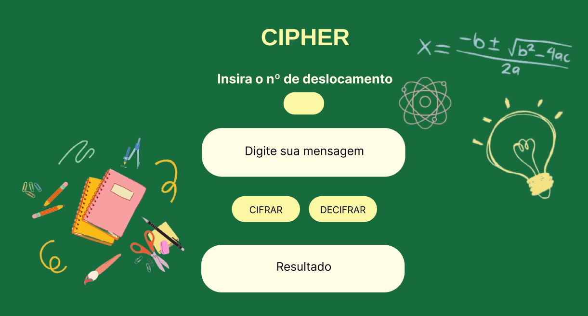

# Cifra de César

## 1. Prefácio

Cifrar significa codificar. A [cifra de César](https://pt.wikipedia.org/wiki/Cifra_de_C%C3%A9sar)
é um dos primeiros tipos de criptografias conhecidas na história.
O imperador romano Júlio César utilizava essa cifra para enviar
ordens secretas aos seus generais no campo de batalha.

A cifra de César é uma das técnicas mais simples de cifrar uma mensagem. É um
tipo de cifra por substituição, em que cada letra do texto original é
substituida por outra que se encontra há um número fixo de posições
(deslocamento) mais a frente do mesmo alfabeto.

Por exemplo se usarmos o deslocamento (_offset_) de 3 posições:

* Alfabeto sem cifrar: A B C D E F G H I J K L M N O P Q R S T U V W X Y Z
* Alfabeto com cifra:  D E F G H I J K L M N O P Q R S T U V W X Y Z A B C
* A letra A será D
* A palavra CASA será FDVD

## 2. Resumo do projeto

O objetivo deste projeto foi criar uma aplicação web que permita ao usuário cifrar e decifrar uma menssagem, a partir da escolha de uma chave de deslocamento. Ela seria entregue às escolas, que a disponibilizariam aos seus alunos, para poderem utilizar caso eles estivessem sofrendo bullying ou algum tipo de abuso em casa. 

Com interface intuitiva e discreta, a aplicação não expõe sua real função a quem utilizar. Isso foi feito se pensando na possibilidade de eventuais abusadores se depararem com ela. Com isso, o aluno poderia simplesmente dizer que é um joguinho ou alguma plataforma para fazer um trabalho escolar, e assim, não sofrer consequências negativas.

Com essa aplicação web, espera-se que os alunos consigam pedir ajuda e expor o que está acontecendo com eles, e que as escolas possam tomar as devidas providências e evitar que algo pior aconteça. 

O nome *"It's cool"* foi uma brincadeira com sua pronúncia, pois ela se assemelha à palavra *"school"*, que significa escola.

## 3. Protótipo do projeto

## 4. Processo de desenvolvimento do produto

  * Levantamento de questões sociais
  * Escolha do tema
  * Escolha do público alvo
  * Planejamento
  * Criação do protótipo
  * Estudo do conteúdo proposto
  * Codificação
  * Testagem
  * Deploy - Git Pages

## 5. Considerações técnicas

**Linguagens utilizadas:** JavaScript | HTML5 | CSS3

**Programas/Plataformas utilizadas:** VSCode (codificação) | Figma (protótipo) | Trello (planejamento) | Canva (imagem de fundo)

## 6. Implementações futuras

  * Reconhecer espaços 
  * Aceitar caracteres especiais

## 7. Objetivos de aprendizagem

### HTML

- [ ] **Uso de HTML semântico**

  

Links

  * [HTML semântico](https://curriculum.laboratoria.la/pt/topics/html/02-html5/02-semantic-html)
  * [Semantics in HTML - MDN](https://developer.mozilla.org/en-US/docs/Glossary/Semantics#Semantics_in_HTML)

### CSS

- [ ] **Uso de seletores de CSS**

  

Links

  * [Intro a CSS](https://curriculum.laboratoria.la/pt/topics/css/01-css/01-intro-css)
  * [CSS Selectors - MDN](https://developer.mozilla.org/pt_BR/docs/Web/CSS/CSS_Selectors)

- [ ] **Modelo de caixa (box model): borda, margem, preenchimento**

  

Links

  * [Modelo de Caixa e Display](https://curriculum.laboratoria.la/pt/topics/css/01-css/02-boxmodel-and-display)
  * [The box model - MDN](https://developer.mozilla.org/en-US/docs/Learn/CSS/Building_blocks/The_box_model)
  * [Introduction to the CSS box model - MDN](https://developer.mozilla.org/en-US/docs/Web/CSS/CSS_Box_Model/Introduction_to_the_CSS_box_model)
  * [CSS display - MDN](https://developer.mozilla.org/pt-BR/docs/Web/CSS/display)
  * [display - CSS Tricks](https://css-tricks.com/almanac/properties/d/display/)

### Web APIs

- [ ] **Uso de seletores de DOM**

  

Links

  * [Modificando o DOM](https://curriculum.laboratoria.la/pt/topics/browser/02-dom/03-1-dom-methods-selection)
  * [Introdução ao DOM - MDN](https://developer.mozilla.org/pt-BR/docs/Web/API/Document_Object_Model/Introduction)
  * [Locating DOM elements using selectors - MDN](https://developer.mozilla.org/en-US/docs/Web/API/Document_object_model/Locating_DOM_elements_using_selectors)

- [ ] **Manipulação de eventos de DOM (listeners, propagação, delegação)**

  

Links

  * [Introdução a eventos - MDN](https://developer.mozilla.org/pt-BR/docs/Learn/JavaScript/Building_blocks/Events)
  * [EventTarget.addEventListener() - MDN](https://developer.mozilla.org/pt-BR/docs/Web/API/EventTarget/addEventListener)
  * [EventTarget.removeEventListener() - MDN](https://developer.mozilla.org/pt-BR/docs/Web/API/EventTarget/removeEventListener)
  * [Objeto Event](https://developer.mozilla.org/pt-BR/docs/Web/API/Event)

- [ ] **Manipulação dinâmica de DOM**

  

Links

  * [Introdução ao DOM](https://developer.mozilla.org/pt-BR/docs/DOM/Referencia_do_DOM/Introdu%C3%A7%C3%A3o)
  * [Node.appendChild() - MDN](https://developer.mozilla.org/pt-BR/docs/Web/API/Node/appendChild)
  * [Document.createElement() - MDN](https://developer.mozilla.org/pt-BR/docs/Web/API/Document/createElement)
  * [Document.createTextNode()](https://developer.mozilla.org/pt-BR/docs/Web/API/Document/createTextNode)
  * [Element.innerHTML - MDN](https://developer.mozilla.org/pt-BR/docs/Web/API/Element/innerHTML)
  * [Node.textContent - MDN](https://developer.mozilla.org/pt-BR/docs/Web/API/Node/textContent)

### JavaScript

- [ ] **Tipos de dados primitivos**

  

Links

  * [Valores Primitivos - MDN](https://developer.mozilla.org/pt-BR/docs/Web/JavaScript/Data_structures#valores_primitivos)

- [ ] **Strings (cadeias de caracteres)**

  

Links

  * [Strings](https://curriculum.laboratoria.la/pt/topics/javascript/06-strings)
  * [String — Cadeia de caracteres - MDN](https://developer.mozilla.org/pt-BR/docs/Web/JavaScript/Reference/Global_Objects/String)

- [ ] **Variáveis (declaração, atribuição, escopo)**

  

Links

  * [Valores, tipos de dados e operadores](https://curriculum.laboratoria.la/pt/topics/javascript/01-basics/01-values-variables-and-types)
  * [Variáveis](https://curriculum.laboratoria.la/pt/topics/javascript/01-basics/02-variables)

- [ ] **Uso de condicionais (if-else, switch, operador ternário, lógica booleana)**

  

Links

  * [Estruturas condicionais e repetitivas](https://curriculum.laboratoria.la/pt/topics/javascript/02-flow-control/01-conditionals-and-loops)
  * [Tomando decisões no seu código — condicionais - MDN](https://developer.mozilla.org/pt-BR/docs/Learn/JavaScript/Building_blocks/conditionals)

- [ ] **Uso de laços (while, for, for..of)**

  

Links

  * [Laços (Loops)](https://curriculum.laboratoria.la/pt/topics/javascript/02-flow-control/02-loops)
  * [Laços e iterações - MDN](https://developer.mozilla.org/pt-BR/docs/Web/JavaScript/Guide/Loops_and_iteration)

- [ ] **Funções (params, args, return)**

  

Links

  * [Funções (controle de fluxo)](https://curriculum.laboratoria.la/pt/topics/javascript/02-flow-control/03-functions)
  * [Funções clássicas](https://curriculum.laboratoria.la/pt/topics/javascript/03-functions/01-classic)
  * [Arrow Functions](https://curriculum.laboratoria.la/pt/topics/javascript/03-functions/02-arrow)
  * [Funções — blocos reutilizáveis de código - MDN](https://developer.mozilla.org/pt-BR/docs/Learn/JavaScript/Building_blocks/Functions)

- [ ] **Testes unitários (unit tests)**

  

Links

  * [Introdução ao Jest - Documentação oficial](https://jestjs.io/docs/pt-BR/getting-started)

- [ ] **Módulos de ECMAScript (ES modules)**

  

Links

  * [import - MDN](https://developer.mozilla.org/pt-BR/docs/Web/JavaScript/Reference/Statements/import)
  * [export - MDN](https://developer.mozilla.org/pt-BR/docs/Web/JavaScript/Reference/Statements/export)

- [ ] **Uso de linter (ESLINT)**

- [ ] **Uso de identificadores descritivos (Nomenclatura e Semântica)**

### Controle de Versões (Git e GitHub)

- [ ] **Git: Instalação e configuração**

- [ ] **Git: Controle de versão com git (init, clone, add, commit, status, push, pull, remote)**

- [ ] **GitHub: Criação de contas e repositórios, configuração de chave SSH**

- [ ] **GitHub: Implantação com GitHub Pages**

  

Links

  * [Site oficial do GitHub Pages](https://pages.github.com/)

### Centrado no usuário

- [ ] **Desenhar e desenvolver um produto ou serviço colocando as usuárias no centro**

### Design de produto

- [ ] **Criar protótipos para obter feedback e iterar**

- [ ] **Aplicar os princípios de desenho visual (contraste, alinhamento, hierarquia)**

